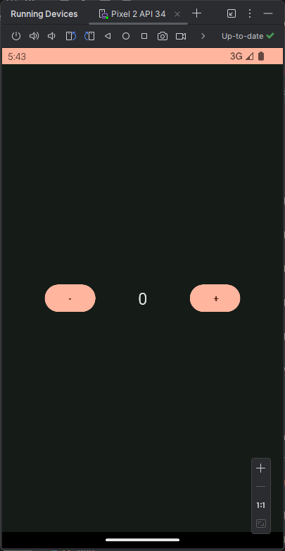

# MVVM Counter App

## Intro

Yeah, I know it's just a goddamn counter app, but the reason I done this is to test the MVVM
architecture in android's Jetpack Compose. This is part of [The Complete Android 14 & Kotlin Development Masterclass](https://www.udemy.com/course/android-kotlin-developer/learn/).

## Showcase

Example of usage:

